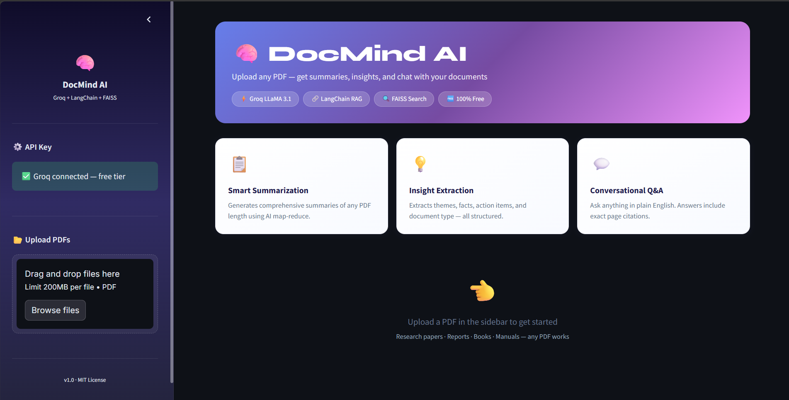
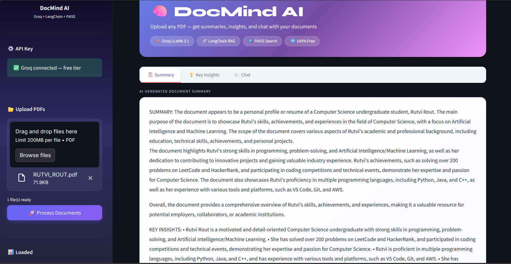
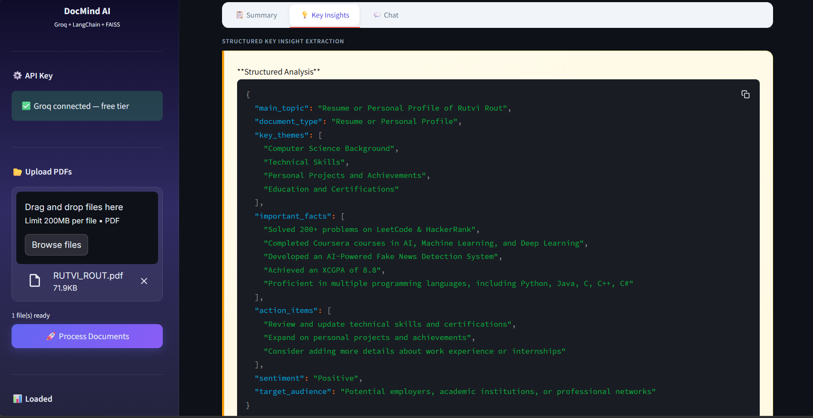
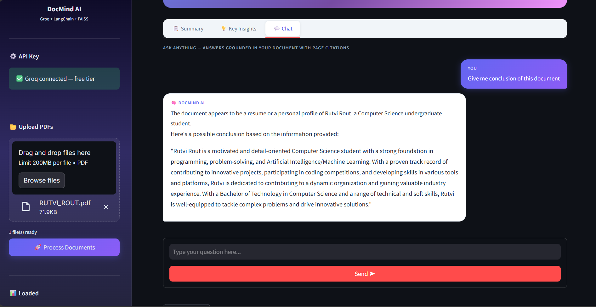

# 🧠 DocMind AI — Document Intelligence System


An AI-powered document intelligence platform that transforms static PDFs into interactive knowledge sources. Upload any PDF, get instant AI summaries, extract structured insights, and have a full conversation with your documents — powered entirely by **free** tools.

> **No credit card. No paid API. Completely free to run.**

---

## 📸 Screenshots

### 🏠 Landing Page


### 📋 Summary Tab


### 💡 Key Insights Tab


### 💬 Chat Tab


---

## ✨ Features

| Feature | Description |
|---|---|
| 📋 **Smart Summarization** | Map-reduce summarization handles documents of any length without hitting token limits |
| 💡 **Insight Extraction** | Structured extraction of themes, key facts, audience, sentiment, and action items |
| 💬 **Conversational Q&A** | Multi-turn chat with memory — ask follow-up questions naturally |
| 📍 **Source Citations** | Every answer shows the exact page number and file it came from |
| 🔍 **Semantic Search** | FAISS vector store finds the most relevant sections for each question |
| 📂 **Multi-Document** | Upload and query across multiple PDFs simultaneously |
| 💡 **Follow-up Suggestions** | AI suggests next questions so you explore documents more deeply |
| 🆓 **100% Free** | Uses Groq (free LLM) + HuggingFace (free local embeddings) |

---

## 🏗️ Architecture

```
User Upload (PDF)
      │
      ▼
┌──────────────────────────────────────────────────────────────┐
│                   PDFProcessor (LangChain)                    │
│  PyPDFLoader → RecursiveCharacterTextSplitter → FAISS Index   │
│  Embeddings: HuggingFace all-MiniLM-L6-v2 (runs locally)     │
└──────────────────────────────────────────────────────────────┘
         │                              │
         ▼                              ▼
┌────────────────┐           ┌─────────────────────────┐
│  Summarizer    │           │       QA Engine          │
│  (LangChain)   │           │  ConversationalChain     │
│                │           │  + BufferWindowMemory    │
│  map_reduce    │           │  + FAISS Retriever       │
│  chain         │           └─────────────────────────┘
└────────────────┘                      │
         │                              ▼
         ▼                   ┌─────────────────────────┐
┌────────────────┐           │   Groq API (FREE)        │
│   Insights     │           │   LLaMA 3.1 8B Instant   │
│   Extraction   │           │   Ultra-fast inference   │
└────────────────┘           └─────────────────────────┘
         │
         ▼
┌──────────────────────────────────┐
│     Streamlit Web Interface      │
│  Summary · Insights · Chat Tab   │
└──────────────────────────────────┘
```

---

## 🚀 Quick Start

### Prerequisites
- Python 3.11 or 3.12
- A **free** Groq API key — get one at [console.groq.com](https://console.groq.com) (no credit card needed)

### 1. Clone the Repository
```bash
git clone https://github.com/YOUR_USERNAME/ai-document-intelligence.git
cd ai-document-intelligence
```

### 2. Create and Activate Virtual Environment
```bash
# Windows
python -m venv venv
venv\Scripts\activate

# macOS / Linux
python -m venv venv
source venv/bin/activate
```

You should see `(venv)` appear in your terminal. Keep this active whenever working on the project.

### 3. Install Dependencies
```bash
pip install -r requirements.txt
```

> First install downloads the HuggingFace embedding model (~80MB). This only happens once.

### 4. Set Up Your Free API Key

```bash
# Windows
copy .env.example .env

# macOS / Linux
cp .env.example .env
```

Open `.env` in any text editor and add your Groq key:
```
GROQ_API_KEY=gsk_your_key_here
```

### 5. Run the App
```bash
streamlit run app.py
```

Opens automatically at **http://localhost:8501**

---

## 📖 How to Use

1. **Paste your Groq API key** in the sidebar (or set it in `.env` beforehand)
2. **Upload one or more PDFs** using the sidebar file uploader
3. **Click "Process Documents"** — embeds all content into the local vector store
4. Use the three tabs:
   - **📋 Summary** → click "Generate Summary" for a full AI-written summary
   - **💡 Key Insights** → click "Extract Insights" for structured analysis
   - **💬 Chat** → type any question, get answers with page citations

---

## 🗂️ Project Structure

```
ai-document-intelligence/
├── app.py                  # Streamlit web app — main entry point
├── requirements.txt        # All Python dependencies
├── .env.example            # Template for environment variables
├── .env                    # Your actual API key (never committed to git)
├── .gitignore              # Keeps secrets and temp files out of git
├── README.md               # This file
├── LICENSE
├── screenshots/            # App screenshots for README
│   ├── landing.png
│   ├── summary.png
│   ├── insights.png
│   └── chat.png
├── src/
│   ├── __init__.py
│   ├── pdf_processor.py    # PDF loading, chunking, FAISS vector store
│   ├── summarizer.py       # Map-reduce summarization + insight extraction
│   └── qa_engine.py        # Conversational Q&A with memory
├── tests/
│   └── test_basic.py       # Unit tests — run with: pytest tests/ -v
└── data/                   # Place your test PDFs here (gitignored)
```

---

## 🛠️ Tech Stack

| Component | Technology | Cost |
|---|---|---|
| **LLM** | Groq — LLaMA 3.1 8B Instant | 🆓 Free |
| **Embeddings** | HuggingFace `all-MiniLM-L6-v2` | 🆓 Free (runs locally) |
| **RAG Framework** | LangChain 0.2 | 🆓 Free |
| **Vector Store** | FAISS (Facebook AI) | 🆓 Free |
| **PDF Parsing** | PyPDF | 🆓 Free |
| **Web UI** | Streamlit | 🆓 Free |
| **Memory** | LangChain ConversationBufferWindowMemory | 🆓 Free |

**Total running cost: $0.00**

---

## 🧪 Running Tests

```bash
pip install pytest
pytest tests/ -v
```

Expected output:
```
tests/test_basic.py::TestPDFProcessor::test_import PASSED
tests/test_basic.py::TestPDFProcessor::test_init_defaults PASSED
tests/test_basic.py::TestQAEngine::test_clear_memory PASSED
...
```

---

## 💡 Key Concepts Demonstrated

- **RAG (Retrieval-Augmented Generation)** — Retrieves relevant chunks before generating answers, grounding responses in actual document content and preventing hallucinations
- **Map-Reduce Summarization** — Splits large documents into chunks, summarizes each (map), then combines into a final summary (reduce) — handles any document length
- **Vector Embeddings** — Converts text into numerical vectors so semantically similar content can be found even when exact words differ
- **Conversational Memory** — Keeps a sliding window of recent Q&A pairs so follow-up questions ("tell me more about that") work naturally
- **Chunk Overlap** — Sliding window chunking with overlap ensures no information is lost at chunk boundaries

---

## 📈 Potential Extensions

- [ ] Support Word (.docx), text (.txt), and web URLs as input
- [ ] Deploy to [Streamlit Cloud](https://streamlit.io/cloud) for free public hosting
- [ ] Add local LLM support via Ollama (fully offline, no internet needed)
- [ ] Export summaries and chat history as downloadable PDF reports
- [ ] Side-by-side document comparison mode
- [ ] Google Drive / Dropbox integration for cloud document access

---

## 🔧 Troubleshooting

**`(venv)` not showing after activation on Windows:**
```bash
Set-ExecutionPolicy -ExecutionPolicy RemoteSigned -Scope CurrentUser
venv\Scripts\activate
```

**`ModuleNotFoundError` when running the app:**
Make sure your venv is active — you should see `(venv)` in the terminal. Then re-run `pip install -r requirements.txt`.

**Groq API key error:**
- Key must start with `gsk_`
- Get a free key at [console.groq.com](https://console.groq.com)
- Make sure there are no spaces in your `.env` file

**First run is slow:**
The HuggingFace embedding model downloads once (~80MB) on first use. After that it's cached and loads instantly.

---

## 📄 License

MIT License — see [LICENSE](LICENSE) for details. Free to use, modify, and distribute.

---

## 🙏 Acknowledgements

- [Groq](https://groq.com/) for blazing-fast free LLM inference
- [LangChain](https://python.langchain.com/) for the RAG and chain framework
- [HuggingFace](https://huggingface.co/) for free open-source embedding models
- [Streamlit](https://streamlit.io/) for the web interface
- [FAISS](https://github.com/facebookresearch/faiss) for vector similarity search by Meta AI